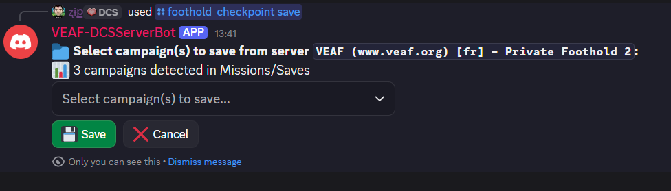
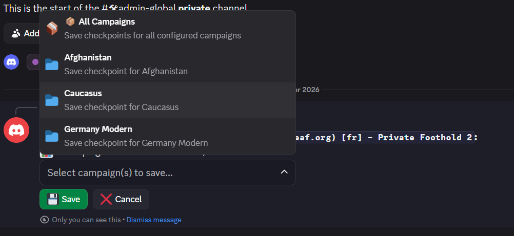
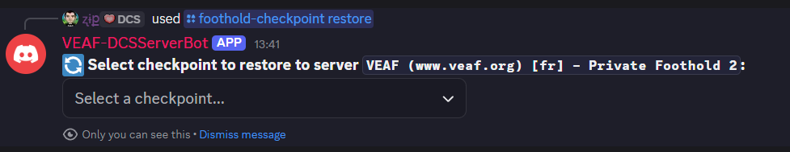
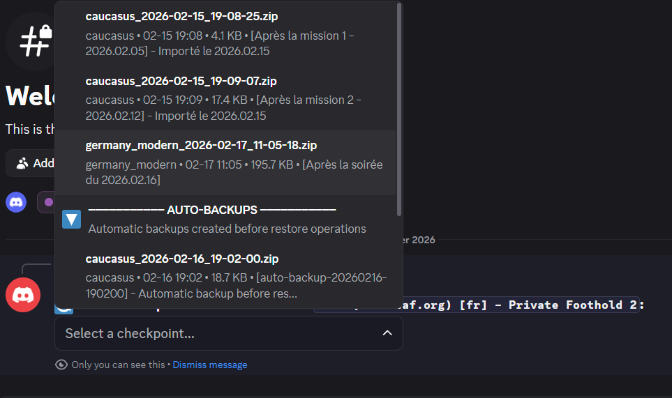
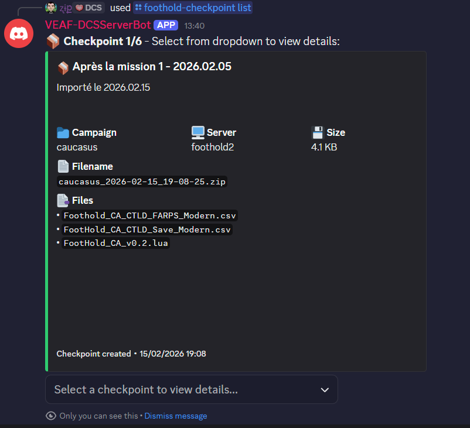
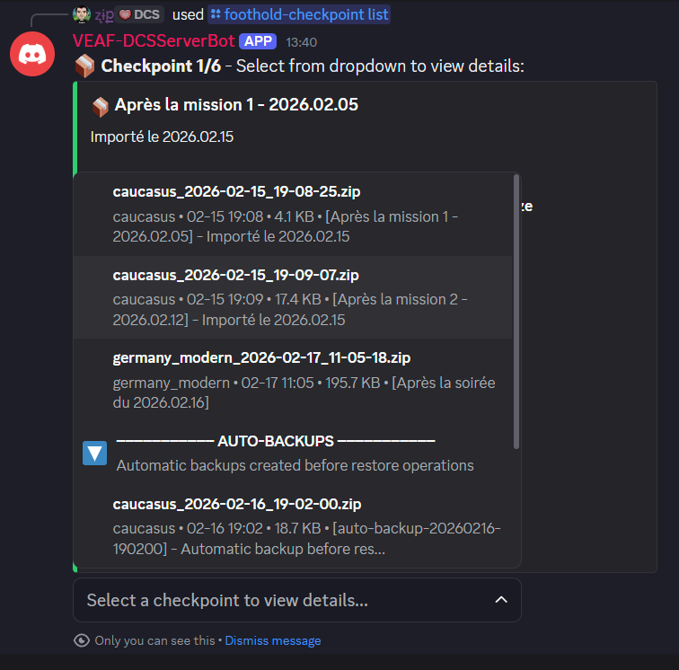
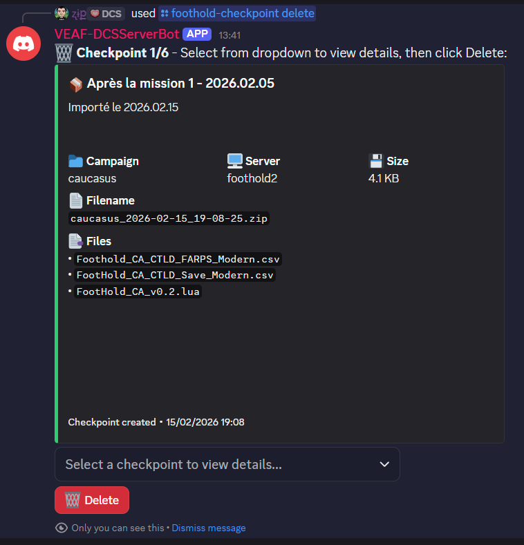
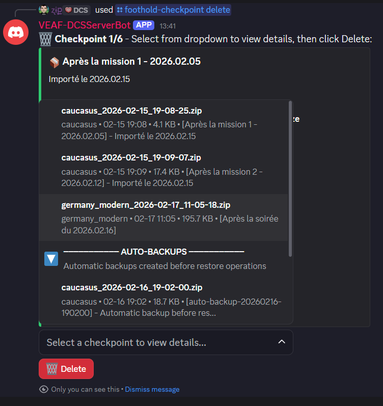

# Foothold Checkpoint Tool - Discord User Manual

**Version 2.1.0** | English

Complete guide for managing DCS Foothold campaign checkpoints using Discord commands.

---

## Table of Contents

- [Introduction](#introduction)
- [What are Checkpoints?](#what-are-checkpoints)
- [Getting Started](#getting-started)
- [Available Commands](#available-commands)
  - [Save Checkpoint](#save-checkpoint)
  - [Restore Checkpoint](#restore-checkpoint)
  - [List Checkpoints](#list-checkpoints)
  - [Delete Checkpoint](#delete-checkpoint)
- [Usage Examples](#usage-examples)
- [Understanding Checkpoint Details](#understanding-checkpoint-details)
- [Best Practices](#best-practices)
- [Troubleshooting](#troubleshooting)
- [FAQ](#faq)

---

## Introduction

The Foothold Checkpoint Tool is a Discord bot plugin that allows you to save, restore, and manage snapshots (checkpoints) of your DCS Foothold campaign progress. This ensures you never lose campaign progress due to bugs, testing, or accidents.

### Key Features

- 💾 **Save Campaign State**: Create timestamped backups of entire campaigns
- ♻️ **Restore Campaigns**: Roll back to any previous checkpoint
- 📋 **Browse Checkpoints**: View all available backups with details
- 🗑️ **Manage Storage**: Delete old or unwanted checkpoints
- 🛡️ **Auto-Backup**: Automatic backup before restore operations
- 🎯 **Interactive UI**: Easy-to-use dropdown menus and buttons

---

## What are Checkpoints?

A **checkpoint** is a complete snapshot of a Foothold campaign's state at a specific moment in time. It includes:

- **Campaign persistence file** (`.lua`) - Main campaign state
- **CTLD save files** (`.csv`) - Troop positions and logistics
- **CTLD FARP files** (`.csv`) - Forward base states
- **Storage files** (`.csv`) - Resource inventories
- **Metadata** - Campaign name, server, timestamp, size, checksums

Each checkpoint is stored as a single compressed ZIP file with integrity verification.

### What Checkpoints Are Used For

- **Before Major Operations**: Save before risky missions
- **Testing New Content**: Create a restore point before testing changes
- **Weekly Backups**: Regular saves for disaster recovery
- **Server Migrations**: Move campaigns between test and production servers
- **Bug Recovery**: Roll back if a DCS bug corrupts campaign files

---

## Getting Started

### Prerequisites

Before using the checkpoint commands, make sure:

1. ✅ You have the required Discord role (check with your server admin)
2. ✅ The bot is online and responsive
3. ✅ You know which **server** you want to work with
4. ✅ You know which **campaign** you want to save/restore

### Required Permissions

Different commands require different Discord roles:

| Command | Typical Roles Required |
|---------|----------------------|
| **Save** | DCS Admin, Mission Designer |
| **Restore** | DCS Admin (most restrictive) |
| **List** | Everyone (read-only) |
| **Delete** | DCS Admin |

> **Note**: Actual permissions depend on your server's configuration. Contact your admin if you don't have access.

### First Time Setup

No setup required! Just type `/foothold-checkpoint` in Discord and select the command you need.

---

## Available Commands

All commands are under the `/foothold-checkpoint` group. Type `/foothold-checkpoint` in Discord to see autocomplete suggestions.

---

### Save Checkpoint

Create a new checkpoint of a campaign's current state.

#### Command Syntax

```
/foothold-checkpoint save server:<server_name>
```

#### Parameters

| Parameter | Required | Description |
|-----------|----------|-------------|
| `server` | ✅ Yes | Server name (autocomplete available) |

**All other options are selected interactively** through dropdown menus and modal windows.

#### How to Use

1. Type `/foothold-checkpoint save server:Production`
2. Press Enter - an interactive campaign selection menu appears
3. Select which campaign(s) to save from the dropdown
4. (Optional) A modal window appears where you can enter:
   - **Name**: Custom checkpoint name
   - **Comment**: Description or notes  
5. Click Submit

#### Examples

**Save a single campaign:**
```
/foothold-checkpoint save server:Caucasus
```
Then select "Syria Modern" from the dropdown menu.

**Save all campaigns on a server:**
```
/foothold-checkpoint save server:Production
```
Then select **"📦 All Campaigns"** from the dropdown.

**Save with custom name and comment:**
```
/foothold-checkpoint save server:Afghanistan
```
Select campaign, then fill in the modal:
- Name: `End-of-Week-Backup`
- Comment: `Before testing new CTLD features`

#### Screenshots


*Step 1: Select campaign from dropdown menu*


*Step 2: Enter custom name and comment (optional)*

#### What Happens

1. ✅ Bot reads current campaign files from server's `Missions/Saves` folder
2. ✅ Creates a compressed ZIP checkpoint with timestamp
3. ✅ Calculates integrity checksums for all files
4. ✅ Stores metadata (server, campaign, date, size)
5. ✅ Sends confirmation with checkpoint details
6. ✅ (Optional) Posts notification to configured channel

#### Success Message

```
✅ Checkpoint saved successfully!

Filename: afghanistan_2026-02-16_20-15-30.zip
Campaign: Afghanistan
Server: Production
Size: 2.4 MB
Files: 4
Name: Pre-Mission-14
Comment: Before enemy counterattack

Created: 2026-02-16 20:15:30
```

---

### Restore Checkpoint

Restore a campaign to a previous checkpoint state.

#### Command Syntax

```
/foothold-checkpoint restore
```

#### Parameters

| Parameter | Required | Description |
|-----------|----------|-------------|
| `server` | ✅ Yes | Target server name |
| `checkpoint` | ❌ No | Checkpoint filename (or leave empty for dropdown) |
| `campaign` | ❌ No | Campaign name (defaults to checkpoint's original campaign) |
| `auto_backup` | ❌ No | Create backup before restore (default: true) |

#### How to Use

**Option 1: Interactive Mode (Recommended)**

1. Type `/foothold-checkpoint restore`
2. Select the **server** to restore to
3. Press Enter - a dropdown appears with all checkpoints
4. Select the checkpoint you want to restore
5. Confirm the restoration

**Option 2: Direct Mode**

Type everything in one command:
```
/foothold-checkpoint restore server:TestServer checkpoint:afghanistan_2026-02-15_14-00-00.zip
```

#### Checkpoint Selection Dropdown

Checkpoints are grouped and sorted for easy browsing:

```
Checkpoints Manuels (plus récent en bas)

afghanistan_2026-02-14_10-00-00.zip
afghanistan • 02-14 10:00 • 2.3 MB

afghanistan_2026-02-16_20-15-30.zip
afghanistan • 02-16 20:15 • 2.4 MB • [Pre-Mi...

─────────── AUTO-BACKUPS ───────────

auto-backup-20260216-201000.zip
afghanistan • 02-16 20:10 • 2.4 MB
```

- **Manual checkpoints** appear first (newest at bottom)
- **Auto-backups** appear after the separator
- Shows: campaign name, date/time, file size, and name/comment if available

#### Auto-Backup Protection

The bot **always creates an automatic backup** before restoring to prevent data loss.

The auto-backup:
- Is created with filename pattern: `auto-backup-YYYYMMDD-HHMMSS.zip`
- Contains the current state before restore
- Appears in the "AUTO-BACKUPS" section when listing
- Can be restored like any other checkpoint

⚠️ **Note**: Auto-backup cannot be disabled - it's a mandatory safety feature in v2.1.0.

#### Examples

**Restore to production server:**
```
/foothold-checkpoint restore server:Production
```
Then select the checkpoint from the interactive browser.

**Restore to test server:**
```
/foothold-checkpoint restore server:TestServer
```
Select checkpoint, review details, and confirm.

**Cross-server restore (move checkpoint between servers):**
```
/foothold-checkpoint restore server:ProductionServer
```
Select a checkpoint from any server/campaign - the bot automatically handles file renaming.

#### Screenshots


*Step 1: Browse and select checkpoint from interactive dropdown*


*Step 2: Review details and confirm restoration*

#### What Happens

1. ✅ Bot validates checkpoint integrity (checksums)
2. ✅ Creates automatic backup of current state (mandatory)
3. ✅ Extracts checkpoint files to server's `Missions/Saves` folder
4. ✅ Renames files to match current campaign naming conventions
5. ✅ Sends confirmation with details
6. ✅ (Optional) Posts notification to configured channel

#### Success Message

```
♻️ Checkpoint restored successfully!

Restored: afghanistan_2026-02-16_20-15-30.zip
To Server: TestServer
Campaign: afghanistan
Auto-Backup: auto-backup-20260216-221045.zip

Files Restored: 4
Original Date: 2026-02-16 20:15:30
Restored At: 2026-02-16 22:10:45
```

#### Important Notes

- 🛡️ **Auto-backup is your safety net** - always created before restore
- 🔄 **Files are automatically renamed** to match current campaign file conventions
- ⚙️ **Server must be stopped** - DCS locks files when running
- 📁 **Ranks file not restored** - `Foothold_Ranks.lua` is excluded by default to preserve player rankings
- 👁️ **Single message UI** - all updates appear in the same message for cleaner Discord interface

---

### List Checkpoints

Browse and view all available checkpoints with their details in an interactive browser.

#### Command Syntax

```
/foothold-checkpoint list
```

#### Parameters

**None** - All navigation is done through the interactive browser interface.

#### How to Use

1. Type `/foothold-checkpoint list`
2. An interactive browser appears with pagination controls
3. Use the navigation buttons to browse checkpoints:
   - ⏪ First page
   - ◀️ Previous page  
   - ▶️ Next page
   - ⏩ Last page
4. Use the filter dropdown to filter by campaign
5. Click 🔄 Refresh to reload the list
```
/foothold-checkpoint list campaign:afghanistan
```

**Filter by server:**
```
/foothold-checkpoint list server:Production
```

**Combined filters:**
```
/foothold-checkpoint list server:Production campaign:afghanistan
```

#### Output Format

Checkpoints are displayed in an aligned table:

```
FILE                              DATE         SIZE
────────────────────────────────────────────────────
afghanistan_20260214_100000       2024-02-14   2.3 MB
afghanistan_20260216_201530       2024-02-16   2.4 MB
syria_20260215_140000             2024-02-15   3.1 MB
─────────────── AUTO-BACKUPS ─────────────────
auto-backup-20260216-201000       2024-02-16   2.4 MB
auto-backup-20260216-221045       2024-02-16   2.4 MB
```

- **Manual checkpoints** appear first (chronologically)
- **Auto-backups** appear below the separator
- Shows filename, date created, and file size

#### Examples

**Browse all checkpoints:**
```
/foothold-checkpoint list
```
Navigate through pages and use filter dropdown to find specific campaigns.

**Quick checkpoint review:**
```
/foothold-checkpoint list
```
Use filter to show only "afghanistan" checkpoints, then browse.

#### Screenshots


*Interactive checkpoint browser with pagination*


*Filter checkpoints by campaign or server*

---

### Delete Checkpoint

Remove old or unwanted checkpoints to free up storage.

#### Command Syntax

```
/foothold-checkpoint delete
```

#### Parameters

**None** - All selection is done through the interactive browser interface.

#### How to Use

1. Type `/foothold-checkpoint delete`
2. An interactive checkpoint browser appears
3. Use the filter dropdown to narrow down checkpoints (optional)
4. Select the checkpoint to delete from the dropdown
5. Review the confirmation dialog with checkpoint details
6. Click **"🗑️ Confirm Delete"** to proceed or **"❌ Cancel"** to abort
7. Confirmation must be clicked within 60 seconds

#### Interactive Selection

The dropdown shows checkpoint details to help you choose:

```
afghanistan_2026-01-15_10-00-00.zip
afghanistan • 01-15 10:00 • 2.2 MB

syria_2026-02-01_14-00-00.zip
syria • 02-01 14:00 • 3.0 MB • [Old test]
```

#### Confirmation Required

After selecting, you must click **"Confirm Delete"** button:

```
⚠️ Confirm Deletion

Checkpoint: afghanistan_2026-01-15_10-00-00.zip
Campaign: afghanistan
Created: 2026-01-15 10:00:00
Size: 2.2 MB
Files: 4

This action cannot be undone!

[🗑️ Confirm Delete]  [❌ Cancel]
```

#### Examples

**Delete old checkpoints:**
```
/foothold-checkpoint delete
```
Browse all checkpoints, filter by campaign if needed, select one and confirm.

**Clean up auto-backups:**
```
/foothold-checkpoint delete
```
Look for entries in the AUTO-BACKUPS section and delete old ones.

#### Screenshots


*Step 1: Select checkpoint to delete from browser*


*Step 2: Confirm deletion within 60 seconds*

#### What Happens

1. ✅ Shows checkpoint details and confirmation dialog
2. ✅ Waits for your confirmation (60 second timeout)
3. ✅ Deletes the checkpoint file
4. ✅ Sends confirmation message
5. ✅ (Optional) Posts notification to configured channel

#### Success Message

```
🗑️ Checkpoint deleted successfully!

Deleted: afghanistan_2026-01-15_10-00-00.zip
Campaign: afghanistan
Size: 2.2 MB

Deleted At: 2026-02-16 22:30:00
```

#### Important Notes

- ⚠️ **Deletion is permanent** - cannot be undone
- ⏱️ **60 second timeout** - must confirm within 60 seconds
- 🔐 **Requires permission** - only admins can delete (usually)

---

## Usage Examples

### Weekly Backup Routine

**Every Friday evening, create end-of-week backups:**

```
/foothold-checkpoint save server:Production
→ Select: 📦 All Campaigns
→ Name: Week-7-Backup
→ Comment: End of week 7
```

### Testing New Mission Content

**Before testing a new mission:**

```
# 1. Save current state
/foothold-checkpoint save server:TestServer
→ Select: afghanistan
→ Name: Pre-Mission-15-Test
→ Comment: Before testing new enemy AI

# 2. Test the mission
# ... play mission, see if it works ...

# 3a. If broken, restore previous state
/foothold-checkpoint restore server:TestServer
→ Select: afghanistan_2026-02-16_20-15-30.zip
→ Confirm

# 3b. If good, create new checkpoint
/foothold-checkpoint save server:TestServer
→ Select: afghanistan
→ Name: Post-Mission-15
→ Comment: Mission 15 completed successfully
```

### Moving Campaign Between Servers

**Test on test server before deploying to production:**

```
# 1. Save production state
/foothold-checkpoint save server:Production
→ Select: afghanistan
→ Name: Pre-Update-Backup

# 2. Save current test state
/foothold-checkpoint save server:TestServer
→ Select: afghanistan
→ Name: Updated-Version
→ Comment: After content update

# 3. Test thoroughly on test server
# ... testing ...

# 4. Deploy to production
/foothold-checkpoint restore server:Production
→ Select: afghanistan_updated_2026-02-16.zip (from test server)
→ Confirm

# 5. If problems occur, roll back
/foothold-checkpoint restore server:Production
→ Select: afghanistan_2026-02-16_pre-update.zip
→ Confirm
```

### Monthly Cleanup

**Delete old checkpoints to free space:**

```
# 1. List all checkpoints
/foothold-checkpoint list

# 2. Review and delete old ones
/foothold-checkpoint delete
→ Select: afghanistan_2026-01-10_old-test.zip
→ Confirm Delete

/foothold-checkpoint delete
→ Select: syria_2025-12-15_very-old.zip
→ Confirm Delete
```

### Disaster Recovery

**Campaign files corrupted by DCS bug:**

```
# 1. Browse available backups
/foothold-checkpoint list
→ Use filter to show "afghanistan" checkpoints

# 2. Restore most recent good checkpoint
/foothold-checkpoint restore server:Production
→ Select: afghanistan_2026-02-16_20-15-30.zip (most recent before corruption)
→ Confirm

# Auto-backup of corrupted state saved as: auto-backup-20260216-223000.zip
```

---

## Understanding Checkpoint Details

### Checkpoint Filename Format

Checkpoints use standardized naming:

```
campaign_YYYY-MM-DD_HH-MM-SS.zip
```

Examples:
- `afghanistan_2026-02-16_20-15-30.zip` → Afghanistan campaign saved on Feb 16, 2026 at 20:15:30
- `syria_modern_2026-02-14_10-00-00.zip` → Syria Modern campaign saved on Feb 14, 2026 at 10:00:00

Auto-backups use a different pattern:
```
auto-backup-YYYYMMDD-HHMMSS.zip
```

Example:
- `auto-backup-20260216-201000.zip` → Auto-backup created on Feb 16, 2026 at 20:10:00

### Metadata Fields

Each checkpoint stores:

| Field | Description |
|-------|-------------|
| **Campaign** | Campaign name (e.g., "afghanistan") |
| **Server** | Server where checkpoint was created |
| **Timestamp** | Date and time of creation |
| **Size** | Compressed checkpoint size |
| **Files** | Number of files included |
| **Name** | Optional custom name |
| **Comment** | Optional description |
| **Checksums** | SHA-256 hashes for integrity verification |
| **Auto-backup** | Whether this is an automatic backup |

### What's Included in a Checkpoint

A typical checkpoint contains:

```
✅ foothold_afghanistan.lua              (Required - main campaign state)
✅ foothold_afghanistan_CTLD_Save.csv    (Optional - troop positions)
✅ foothold_afghanistan_CTLD_FARPS.csv   (Optional - FARP states)
✅ foothold_afghanistan_storage.csv      (Optional - resource data)
❌ Foothold_Ranks.lua                    (Excluded - player rankings)
```

### Why Ranks File is Excluded

The `Foothold_Ranks.lua` file tracks player stats and rankings across **all campaigns**. It's excluded from checkpoints because:

- ❌ Restoring it would reset all player statistics
- ❌ It's shared across all Foothold campaigns on a server
- ❌ Player progress should persist across checkpoint restores
- ✅ Campaign-specific state is in the main `.lua` file

---

## Best Practices

### When to Save Checkpoints

**Do save checkpoints:**
- ✅ Before major server updates or DCS patches
- ✅ After important mission completions
- ✅ Weekly/monthly for routine backups
- ✅ Before testing new content or missions
- ✅ After significant campaign progress
- ✅ Before risky operations (e.g., major offensive)

**Don't waste storage with:**
- ❌ Saving every hour (too frequent)
- ❌ Duplicate saves of the same state
- ❌ Testing saves that you won't need later

### Naming Conventions

Use descriptive names and comments:

**Good:**
```
Name: Week-7-Backup
Comment: End of week 7, allied forces control 60% of map

Name: Pre-Patch-2.9.7
Comment: Before DCS 2.9.7 update - backup in case of issues

Name: Mission-15-Complete
Comment: Successfully defended Kabul, resupplied forward bases
```

**Bad:**
```
Name: backup
Comment: save

Name: test
Comment: (empty)

Name: asdf
Comment: checkpoint
```

### Storage Management

- 🗂️ Keep **2-3 recent** checkpoints per campaign
- 🗂️ Keep **1 weekly** checkpoint for the last 4 weeks
- 🗂️ Keep **1 monthly** checkpoint for the last 3 months
- 🗑️ Delete old **auto-backups** after verifying restores worked
- 🗑️ Delete **test checkpoints** after testing is complete

### Auto-Backup Management

Auto-backups accumulate quickly. Clean them up:

```
/foothold-checkpoint list
# (shows auto-backups in separate section)

/foothold-checkpoint delete
→ Select old auto-backup files
→ Confirm deletion
```

Keep only recent auto-backups (last 24-48 hours).

### Testing Restores

**Before relying on a checkpoint, test it:**

1. Restore to test server first
2. Verify campaign loads correctly
3. Check that all features work
4. Then deploy to production if needed

---

## Troubleshooting

### "You don't have permission to use this command"

**Cause**: Your Discord role doesn't have permission for this operation.

**Solution**: Contact your server admin to request access.

### "Server not found"

**Cause**: Server name doesn't exist in bot configuration.

**Solution**: Check available servers using autocomplete. Type `/foothold-checkpoint save server:` and see the suggestions.

### "Campaign not found in checkpoint"

**Cause**: Checkpoint doesn't contain files for the specified campaign.

**Solution**: Use `/foothold-checkpoint list` to see what campaign the checkpoint contains.

### "No campaigns detected"

**Cause**: No campaign files found in server's Missions/Saves folder.

**Possible Reasons**:
- Campaign hasn't been run yet on this server
- Files are in wrong location
- Server configuration incorrect

**Solution**: Run the campaign at least once in DCS to create the save files, or contact admin.

### "Checkpoint file not found"

**Cause**: Checkpoint was deleted or moved.

**Solution**: Use `/foothold-checkpoint list` to see current available checkpoints.

### Restore Doesn't Work

**Possible Causes**:
- ❌ DCS server is running (files are locked)
- ❌ Insufficient disk space
- ❌ Permission issues on server filesystem
- ❌ Corrupted checkpoint file

**Solutions**:
1. Ensure DCS server is stopped
2. Check disk space on server
3. Contact admin if problem persists
4. Try restoring a different checkpoint

### Bot Doesn't Respond

**Possible Causes**:
- ❌ Bot is offline
- ❌ Discord API issues
- ❌ Command syntax error

**Solutions**:
1. Check if bot is online (green status)
2. Try command again
3. Check for typos in command
4. Contact admin if bot is offline

---

## FAQ

### How big are checkpoint files?

Typical checkpoint sizes:
- **Small campaign**: 1-2 MB
- **Medium campaign**: 2-5 MB
- **Large campaign with lots of data**: 5-10 MB

Checkpoints are compressed ZIP files, so they're quite small.

### How many checkpoints should I keep?

Recommended:
- **2-3 recent** checkpoints per campaign (last few days)
- **1 weekly** backup for last month
- **1 monthly** backup for long-term

Delete old auto-backups regularly (they accumulate fast).

### Can I restore a checkpoint to a different server?

Yes! **Cross-server restore** is fully supported. You can:
- Save on **Production** → Restore to **TestServer**
- Save on **TestServer** → Restore to **Production**
- Copy checkpoints between any configured servers

### What happens if restore fails?

If restore fails:
1. ✅ Your **auto-backup** is safe (created before restore started)
2. ✅ Original checkpoint file is **not modified**
3. ✅ Server files remain in their **previous state**
4. ⚠️ Check error message for details
5. ⚠️ Contact admin if problem persists

### Can I download checkpoint files?

Checkpoint files are stored on the DCS server, not in Discord. Contact your server admin if you need direct file access.

### What if I accidentally delete a checkpoint?

**Deletion is permanent** and cannot be undone. However:
- ✅ If you have **auto-backups**, they might contain the same data
- ✅ Check other recent checkpoints for similar saves
- ⚠️ Ask other admins if they have copies
- ⚠️ Always double-check before confirming deletion

### Can multiple people save checkpoints at the same time?

Yes, but you'll get separate checkpoint files with different timestamps. Best practice: coordinate with other admins to avoid confusion.

### Why are some checkpoints in "AUTO-BACKUPS" section?

Auto-backups are created automatically before restore operations to protect against data loss. They appear in a separate section when listing checkpoints.

You can restore auto-backups just like manual checkpoints.

### Do checkpoints include player statistics?

No, `Foothold_Ranks.lua` (player stats) is **intentionally excluded** to preserve player progress across checkpoint restores.

Only campaign-specific files are included.

### Can I rename a checkpoint after creation?

No, checkpoint filenames are fixed. However, you can:
- ✅ Add a custom **name** and **comment** when saving
- ✅ These are stored in metadata and displayed in lists
- ❌ You cannot change the filename after creation

### How long are checkpoints stored?

Checkpoints are stored **indefinitely** until you delete them. The bot doesn't automatically delete old checkpoints - you must manage storage manually.

---

## Need Help?

### Contact Your Server Admin

For issues related to:
- Permission problems
- Server configuration
- Missing campaigns
- Bot offline/not responding

### Report Bugs

If you find a bug in the bot:
- GitHub Issues: https://github.com/VEAF/VEAF-foothold-checkpoint-tool/issues

### Documentation

- **This Manual**: Discord user guide
- **Plugin README**: Technical documentation for admins
- **Main README**: General tool overview

---

**End of User Manual** | Version 2.1.0 | February 2026
